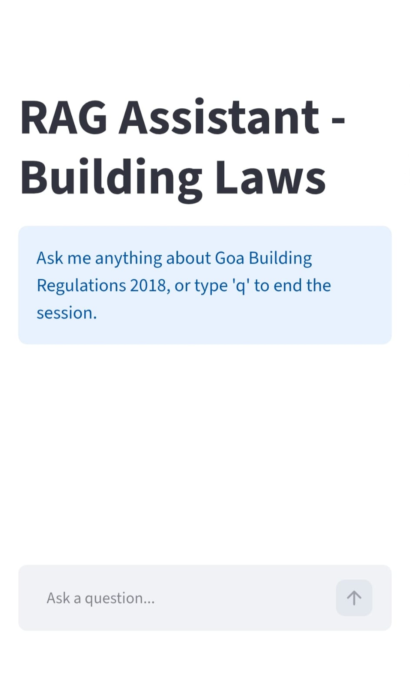

# RAG_QA
The App can answer questions based on the provided Goa Building Laws Book.</br>
Currently, I have prompted it to ask questions back to clarify and understand what the user is looking for.</br>
The app seems to ask additional questions after answering one, and it may confuse the user.</br>
The app also seems to have no conversational memory, asks the same question after a few turns.</br>
</br>
Instead of generating embeddings on every restart, embeddings for the document can be saved here.</br>
Also add, BM25 and Dense Vectors to increase weight for less occurring yet essential keywords like code references etc. 

# 🏛️ Goa Building Regulations AI - RAG Assistant

An AI-powered Retrieval-Augmented Generation (RAG) application designed to help architects, urban planners, and builders, effortlessly navigate and understand the official **Goa Building Regulations**. 

Instead of searching through dense legal texts and planning documents, users can ask natural language questions and receive accurate, context-aware answers backed by source citations.

---
👉 **[Live Demo Link](https://www.loom.com/share/85ab2e904eb649bc9b6c46d0403af5dd)**

## 🌟 Key Features

* **Natural Language Queries:** Ask plain-English questions about setbacks, FAR (Floor Area Ratio), height restrictions, or zoning rules in Goa.
* **Context-Aware Answers:** Utilizes RAG with ChromaDB to pull precise excerpts from the Markdown-formatted Goa Building Regulations.
* **LangGraph Orchestration:** Stateful, flexible Graph-based workflow for retrieval, query processing, and response generation.
* **Streamlit UI:** Clean, intuitive chat interface for seamless interactive user experience.
* **FastAPI Backend:** Lightweight, high-performance asynchronous RESTful API serving the RAG workflow.
* **Containerized & Deployed:** Fully containerized using Docker and deployed on Render for continuous accessibility.

---

## 📸 Screenshots & Demos



---

## 🛠️ Tech Stack

| Component | Technology Used |
| :--- | :--- |
| **Frontend** | Streamlit |
| **Backend API** | FastAPI, Uvicorn |
| **Orchestration** | LangGraph, LangChain |
| **Vector Store** | Chroma DB |
| **LLM & Embeddings** | Gemini |
| **Containerization** | Docker |
| **Deployment** | Render |

---

## 🏗️ System Architecture

1. **Document Ingestion:** The Goa Building Regulations Markdown document is chunked and embedded into **ChromaDB**.
2. **Retrieval Graph:** When a user submits a query, **LangGraph** coordinates retrieving top relevant document chunks from ChromaDB and piping them into the LLM context.
3. **Response Generation:** The LLM synthesizes a concise, legally accurate answer based strictly on the retrieved context.

---

## 📁 Repository Structure
```text
rag-portfolio-app/
├── app/
│   ├── __init__.py
│   ├── rag_pipeline.py   # LangChain, LangGraph & Gemini logic
│   └── main.py           # FastAPI server
├── frontend.py           # Streamlit app
├── knowledge_base.md     # The markdown document
├── embeddings.json       # Preprocessed embeddings database (added later) to avoid regeneration on every restart
├── requirements.txt
├── start.sh              # Shell script to start both processes
└── Dockerfile            # Render container build instructions
```

## ⚙️ How to use the app
Sample Queries:
1. For a sloping site how is the building height measured?
2. What is the FAR for residential plots?
3. Is there a limit to the size of a bathroom?

---

## 🧠 Technical Challenges & Learnings

Previous version of the code read a markdown file, and created embeddings each time the app restarted. To prevent token limit hits, and save time, the document
was separately processed for extracting embeddings. The code has been updated to take embeddings directly from embeddings.json instead of the markdown file.

---

## ✉️ Contact

* **Name**: Ashray Raikar
* **LinkedIn**: [linkedin.com](http://www.linkedin.com/in/ashray-raikar-117b24119)
* **Email**: ashrayraikar@gmail.com
* **GitHub Profile**: [github.com](https://github.com/raikarashray-1)
